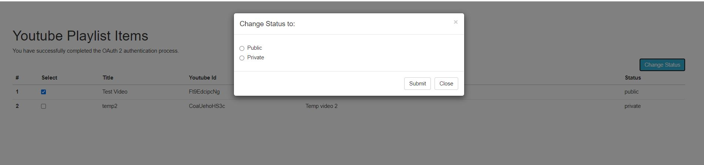

# youtube_api
get all you tube videos and change privacy status 

Steps to install project :
1. git clone repository or download zip
2. npm install

Steps to run project :

1. npm start
2. http://localhost:3001/

